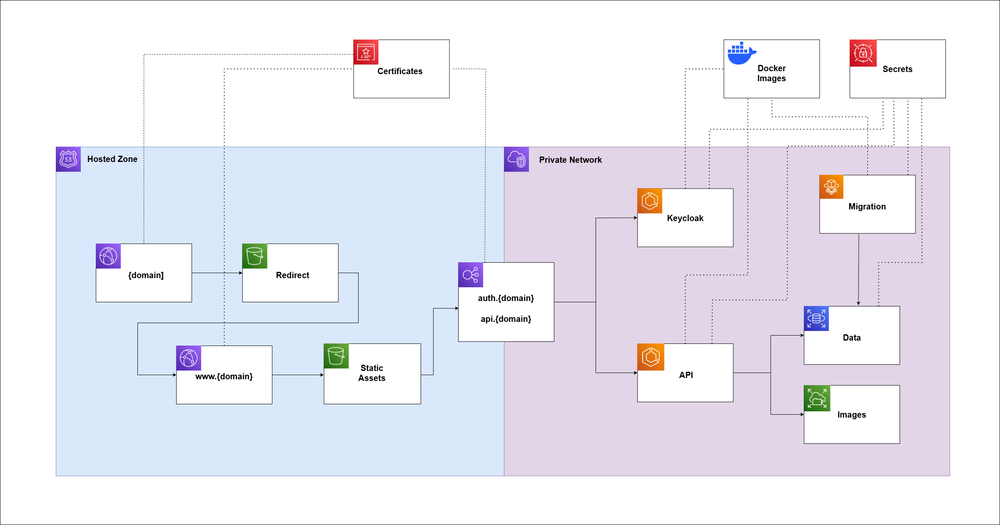
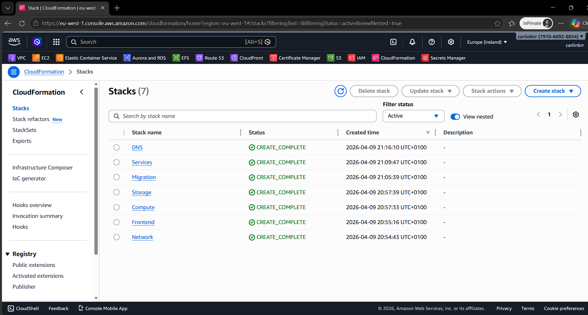
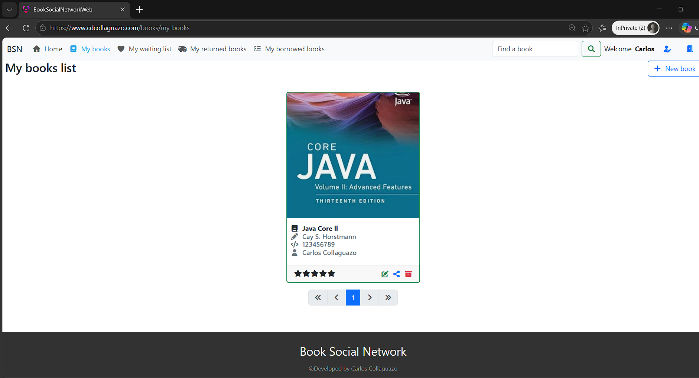

# Deployment

## 1. Overview

Book Social Network is deployed on **AWS** as a coordinated cloud environment where runtime services, data, static content, and routing are managed independently but deployed as a single system.

The deployment is designed so that:

- Application services are exposed only through controlled entry points
- Persistent data and file storage remain independent from runtime services
- Frontend delivery is separated from backend execution
- Infrastructure and application updates can be applied together in a predictable order

---

## 2. Topology

### 2.1 Services

Backend API and Keycloak services run as separate containerized services inside the same cloud environment, using Elastic Container Service **(ECS)**.

Incoming traffic reaches the system through an Application Load Balancer **(ALB)**, which acts as the public entry point and routes requests to the appropriate target based on listener rules.

In this project:

- `api.{domain}` routes to the API service
- `auth.{domain}` routes to the Keycloak service

In addition to long-term running services, the system includes a dedicated migration task, which is executed as a one-off job during deployment.

### 2.2 Frontend Delivery

The frontend is deployed as static assets and delivered separately from the services.

Assets are stored in Data Storage Service **(S3)** and distributed through **CloudFront**.

In this project:

- The main website is served under the subdomain `www.{domain}`
- The root domain `{domain}` doesn't serve any assets
- Separate distributions are used for content delivery and redirection

---

### 2.3 Data and Storage

Persistent relational data is handled outside application runtime.

A Relational Database System **(RDS)** instance stores both application data and Keycloak data in separate logical databases. This keeps state independent from the services that use it and allows schema changes to be managed explicitly as part of deployment.

User-uploaded images are stored in a shared Elastic File System **(EFS)** mounted into the backend API service.

This design ensures that:

- Service instances remain stateless
- File content survives redeployments
- Persistent data is managed independently from services containers

> This storage approach may evolve over time toward object storage, but it currently provides a simple shared file model for user images.

---

### 2.4 Networking, Domains, and Security

All runtime components are deployed inside a Virtual Public Cloud **(VPC)** and exposed only through controlled public entry points.

**Route 53** is used to manage the hosted zone and DNS records.

TLS certificates are created in advance for the root domain and relevant subdomains, via **Certificate Manager**, and are attached to the appropriate public-facing entry points.

Secrets such as credentials and sensitive configuration are stored externally in **Secrets Manager**.

---

---

## 3. Deployment Flow

Deployment is fully automated and executed in a fixed order so that infrastructure dependencies are satisfied before services start.

Each stack deployment may either create resources from scratch or update existing ones, through **CloudFormation**, depending on the current state of the system.

---

### 3.1 Network

The network foundation is deployed first.

This establishes the base environment required by all other components.

### 3.2 Database

The database layer is deployed next.

This prepares the relational data layer required by both the application and Keycloak services.

### 3.3 Compute

The compute infrastructure for this stack is deployed.

This prepares the environment required to execute containerized workloads.

### 3.4 Migration

The migration task is built, published to **Docker Hub** and executed as a one-off runtime job.

This step updates the application schema before the main backend API service is deployed, ensuring the runtime starts against the expected database structure.

### 3.5 File System

The file system infrastructure is deployed.

### 3.6 Services

The backend API and Keycloak services are deployed. Their images are pushed to **Docker Hub** and are pulled at container initialization.

At this point, the runtime services begin serving traffic behind the load balancer.

### 3.7 Frontend

The frontend delivery layer is deployed.

After that, the frontend build artifacts are uploaded, and the CloudFront cache is invalidated so the new version becomes available immediately.

### 3.8 DNS

DNS records are created or updated last.

This ensures that public domain records point only to resources that already exist and are ready to receive traffic.

---

## 4. Prerequisites

Before deployment, a few shared resources must already exist:

- The public hosted zone for the domain
- TLS certificates covering the required root domain and subdomains
- Deployment credentials and all the environment variables required by the system

Without these prerequisites, the final routing and secure public exposure cannot be completed correctly.

---

## 5. Result

Once the full flow completes, all the **CloudFormation** stacks are deployed:

And the system is ready to be used as a complete deployed application on the configured domain. In my case https://www.cdcollaguazo.com

