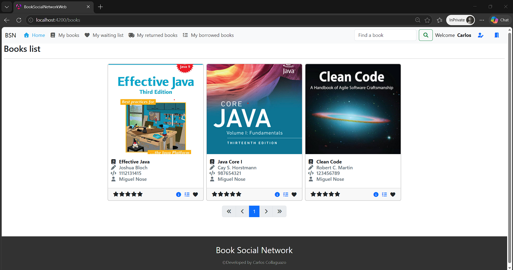

# Local Development

## 1. Requirements

To run the project locally, you only need:

- Java 21
- Node 22
- Docker

---

## 2. Overview

- Local development is designed to keep the setup simple while preserving the same main system components used in the cloud environment
- Infrastructure dependencies such as databases, Keycloak and a local mail service are provided through Docker Compose
- The backend is then started separately using the development Spring Boot profile
- Finally, the frontend is started locally and connects to the backend and identity services already running in the environment

---

## 3. Steps

### 3.1 Start infrastructure dependencies

Open a terminal from the project root directory and start the Docker Compose environment by running:

```
docker compose up -d
```

### 3.2 Start the backend

Move to the backend module:

```
cd apps/api
```

Run the Spring Boot application using the **dev** profile and the required database resources on the classpath.

```
./mvnw spring-boot:run \
  -Dspring-boot.run.profiles=dev \
  -Dspring-boot.run.additional-classpath-elements=../../platform/database
```

This starts the backend API locally and applies the backend database migrations through Flyway.

### 3.3 Start the frontend

Open a new terminal on the project root folder and go to the frontend module:

```
cd apps/web
```

Install the dependencies:

```
npm install
```

Run the development server:

```
npm run start
```

## 4. Access

Once everything is running, you will be able to access to the system! The backend API will be accessible on http://localhost:8080 and frontend on http://localhost:4200.



To see the development mailbox, open: http://localhost:1080

And to access Keycloak console as admin user, open: http://localhost:9090